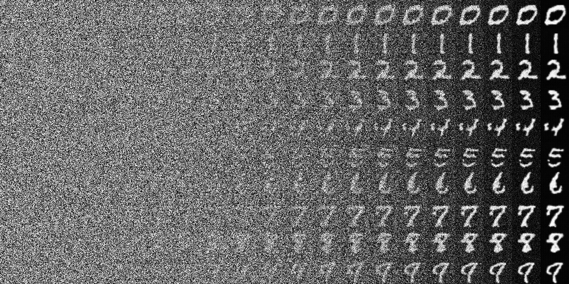

# Diffusion_transformer_from_scratch

## Introduction

Diffusion Transformers trained on MNIST dataset

## Preliminary

- **扩散模型的训练与推理过程**


## Architecture


## key

```python
    def modulate(x, shift, scale):
        return x * (1 + scale.unsqueeze(1)) + shift.unsqueeze(1)

    class DiTBlock(nn.Module):
        """
        A DiT block with adaptive layer norm zero (adaLN-Zero) conditioning.
        """
        def __init__(self, hidden_size, num_heads, mlp_ratio=4.0, **block_kwargs):
            super().__init__()
            self.norm1 = nn.LayerNorm(hidden_size, elementwise_affine=False, eps=1e-6)
            self.attn = Attention(hidden_size, num_heads=num_heads, qkv_bias=True, **block_kwargs)
            self.norm2 = nn.LayerNorm(hidden_size, elementwise_affine=False, eps=1e-6)
            mlp_hidden_dim = int(hidden_size * mlp_ratio)
            approx_gelu = lambda: nn.GELU(approximate="tanh")
            self.mlp = Mlp(in_features=hidden_size, hidden_features=mlp_hidden_dim, act_layer=approx_gelu, drop=0)
            self.adaLN_modulation = nn.Sequential(
                nn.SiLU(),
                nn.Linear(hidden_size, 6 * hidden_size, bias=True)
            )

        def forward(self, x, c):
            shift_msa, scale_msa, gate_msa, shift_mlp, scale_mlp, gate_mlp = self.adaLN_modulation(c).chunk(6, dim=1)
            x = x + gate_msa.unsqueeze(1) * self.attn(modulate(self.norm1(x), shift_msa, scale_msa))
            x = x + gate_mlp.unsqueeze(1) * self.mlp(modulate(self.norm2(x), shift_mlp, scale_mlp))
            return x
```

## Loss


## Inference



## Conclusion

利用DiT架构来替换掉扩散模型中负责预测噪声的Unet。DiT利用了自适应性层归一化(adaLN)的方法来完成条件信息的融合。在原论文中,
作者也验证了Transformer架构在扩散模型上具备较强的Scaling能力, 在稳步增大DiT模型参数量与增强数据质量时, DiT的生成性能稳步提升。


## Acknowledgements

- [Scalable Diffusion Models with Transformers (DiT)](https://github.com/facebookresearch/DiT)
- [pytorch-diffusion-transformer](https://github.com/owenliang/mnist-dits)
- [深入浅出完整解析Stable Diffusion 3（SD 3）和FLUX.1系列核心基础知识](https://zhuanlan.zhihu.com/p/684068402?utm_medium=social&utm_psn=1846210120159203329&utm_source=wechat_session&s_r=0)