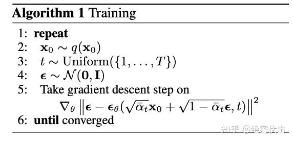
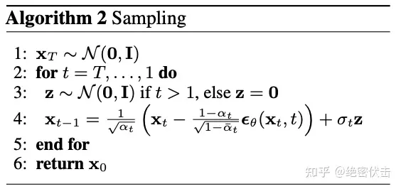

# Diffusion_transformer_from_scratch

## Introduction

Diffusion Transformers trained on MNIST dataset

用transformer-backbone来替换unet-backbone，用于实现stable diffusion扩散模型

## Preliminary
- **扩散模型的前向传播过程**

- **扩散模型的采样过程**

## Architecture

## Loss

## Inference

## Todo

## Acknowledgements

- [Scalable Diffusion Models with Transformers (DiT)](https://github.com/facebookresearch/DiT)
- [pytorch-diffusion-transformer](https://github.com/owenliang/mnist-dits)